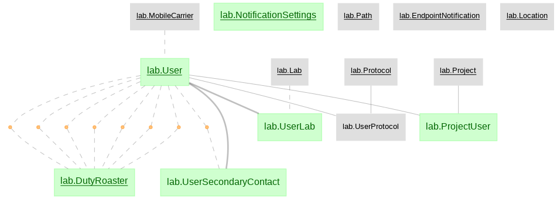
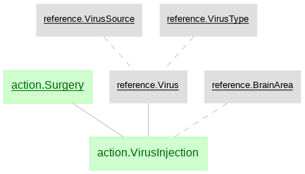
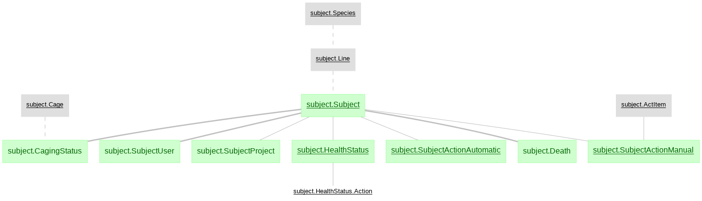
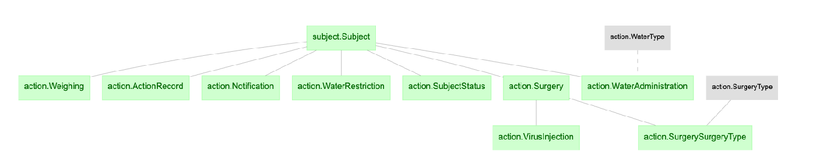
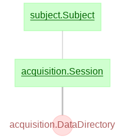
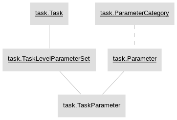
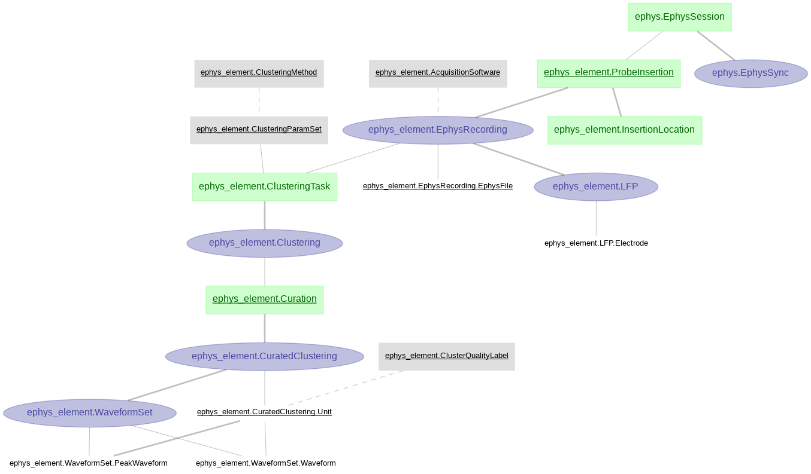
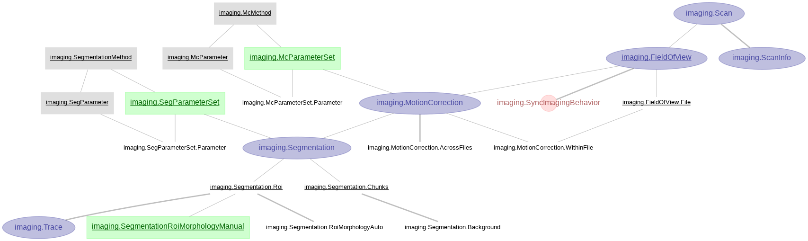
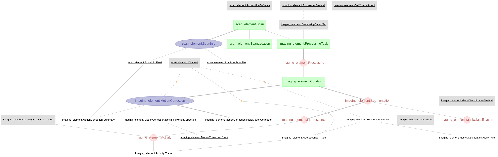

# U19 Python Pipeline

The `U19-pipeline_python` repository defines the DataJoint tables for the U19 projects.  There is a companion [MATLAB DataJoint pipeline](https://github.com/BrainCOGS/U19-pipeline-matlab) where much of this repository has mirrored table definitions.

## Installation

### Recommended prerequisites

+ The following prerequisites are recommended for both installation methods.

  <details>
  <summary>Click to expand details</summary>

    #### Install an integrated development environment

    + DataJoint development and use can be done with a plain text editor in the
      terminal. However, an integrated development environment (IDE) can improve your
      experience. Several IDEs are available.

    + In this setup example, we will use Microsoft's Visual Studio Code.
      [Installation instructions here.](https://code.visualstudio.com/download)

    + Install the Jupyter extension for VS Code.

    #### Install a virtual environment

    + A virtual environment allows you to install the packages required for a 
    specific project within an isolated environment on your computer.

    + It is highly recommended to create a virtual environment to run the workflow.

    + Conda and virtualenv are virtual environment managers and you can use either 
    option.  Below are the commands for Conda.

    + If you are setting up the pipeline on your local machine follow the instructions below for Conda.  If you are using `spock.pni.princeton.edu` or `scotty.pni.princeton.edu`, Conda is preinstalled and you can access it by running `module load anacondapy/2021.11`.

    + We will install Miniconda which is a minimal installer for conda.
      + Select the [Miniconda installer link](
          https://conda.io/en/latest/miniconda.html) 
      for your operating system and follow the instructions.

      + You may need to add the Miniconda directory to the PATH environment 
      variable

        + First locate the Miniconda directory

        + Then modify and run the following command
          ```bash
          export PATH="<absolute-path-to-miniconda-directory>/bin:$PATH"
          ```

    + Create a new conda environment
      + Type the following command into a terminal window
        ```bash
        conda create -n <environment_name> python=<version>
        ```

      + Example command to create a conda environment
        ```bash
        conda create -n U19-pipeline_python_env python=3.9
        ```

    + Activate the conda environment
      ```bash
      conda activate <environment_name>
      ```

    #### Install git
    + Linux and Mac operating systems come preinstalled with Git.  If running in Windows get [Git](https://gitforwindows.org/).

    #### Install graphviz
    + To display DataJoint Diagrams, [install graphviz](https://graphviz.org/download/).

  </details>

### Configuration
    
 #### Repository libraries installation and configuration
    
 + The following instructions will allow a user to access and fetch data from the database.
    
  ```bash
  conda activate <environment_name>
  cd U19-pipeline_python
  pip install -e .
  python initial_conf.py
  ```
  (Username and password will be prompted at this moment: Princeton NETiD & NetiD password usually works)
      
  + The `initial_conf.py`  script will store a local file with credtentials to access DB and configuration variables/filepaths.
  + Now that the virtual modules are created to access the tables in the database, you can query and fetch from the database.

## Tutorials

We have created some tutorial notebooks to help you start working with DataJoint.

1. Querying data
    + `jupyter notebook notebooks/tutorials/1-Explore U19 data pipeline with DataJoint.ipynb`

2. Building analysis pipelines
    + Recommended if you are going to create new databases or tables for analysis.
    + `jupyter notebook notebooks/tutorials/2-Analyze data with U19 pipeline and save results.ipynb`
    + `jupyter notebook notebooks/tutorials/3-Build a simple data pipeline.ipynb`

## Accessing data files on your system

+ There are several data files (behavior, imaging & electrophysiology) that are referenced in the database.
+ To access thse files you should mount PNI file server volumes on your system.
+ There are three main file servers across PNI where data is stored (braininit, Bezos & u19_dj).

  <details>
  <summary>Click to expand details</summary>

    ### On windows systems
    - From Windows Explorer, select "Map Network Drive" and enter: <br>
        [\\\cup.pni.princeton.edu\braininit\\]() (for braininit) <br>
        [\\\cup.pni.princeton.edu\Bezos-center\\]()     (for Bezos) <br>
        [\\\cup.pni.princeton.edu\u19_dj\\]()   (for u19_dj) <br>
    - Authenticate with your **NetID and PU password** (NOT your PNI password, which may be different). When prompted for your username, enter PRINCETON\netid (note that PRINCETON can be upper or lower case) where netid is your PU NetID.
      
    ### On OS X systems
    - Select "Go->Connect to Server..." from Finder and enter: <br>
        [smb://cup.pni.princeton.edu/braininit/]()    (for braininit) <br>
        [smb://cup.pni.princeton.edu/Bezos-center/]()    (for Bezos) <br>
        [smb://cup.pni.princeton.edu/u19_dj/]()   (for u19_dj) <br>
    - Authenticate with your **NetID and PU password** (NOT your PNI password, which may be different).

    ### On Linux systems
    - Follow extra steps depicted in this link: https://npcdocs.princeton.edu/index.php/Mounting_the_PNI_file_server_on_your_desktop

    ### Notable data 
    Here are some shortcuts to common used data accross PNI

    **Sue Ann's Towers Task**
    - Imaging: [/Bezos-center/RigData/scope/bay3/sakoay/{protocol_name}/imaging/{subject_nickname}/]() 
    - Behavior: [/braininit/RigData/scope/bay3/sakoay/{protocol_name}/data/{subject_nickname}/]()

    **Lucas Pinto's Widefield**
    - Imaging [/braininit/RigData/VRwidefield/widefield/{subject_nickname}/{session_date}/]()
    - Behavior [/braininit/RigData/VRwidefield/behavior/lucas/blocksReboot/data/{subject_nickname}/]()

    **Lucas Pinto's Opto inactivacion experiments**
    - Imaging [/braininit/RigData/VRLaser/LaserGalvo1/{subject_nickname}/]()
    - Behavior [/braininit/RigData/VRLaser/behav/lucas/blocksReboot/data/{subject_nickname}/]()

    ### Get path info for the session behavioral file
    1. Mount needed file server
    2. Connect to the Database
    3. Create a structure with subject_fullname and session_date from the session <br>
    ```key['subject_fullname'] = 'koay_K65'``` <br>
    ```key['session_Date'] = '2018-02-05'``` <br>
    4. Fetch filepath info:
    ```data_dir = (acquisition.SessionStarted & key).fetch('remote_path_behavior_file')``` <br>
    
  </details>

## Major schemas in the pipeline

  <details>
  <summary>Click to expand details</summary>

  ### lab

  

  ### reference

  

  ### subject

  

  ### action

  

  ### acquisition

  

  ### task

  

  ### behavior

  Behavior data for Towers task.

  

  ### ephys_element
  + Ephys related tables were created with [DataJoint Element Array Ephys](https://github.com/datajoint/element-array-ephys), processing ephys data aquired with SpikeGLX and pre-processed by Kilosort2.  For this pipeline we are using the (acute) `ephys` module from `element-array-ephys`.

  

  ### imaging
  + Imaging pipeline processed with customized algorithm for motion correction and CNMF for cell segmentation in matlab.

  

  ### scan_element and imaging_element
  + Scan and imaging tables created with [DataJoint Element Calcium Imaging](https://github.com/datajoint/element-calcium-imaging), processing imaging data acquired with ScanImage and pre-processed by Suite2p.

  

  </details>

## Datajoint features
Import datajoint as follows:
```python
import datajoint as dj
```

### Update a table entry
`dj.Table._update(schema.Table & key, 'column_name', 'new_data')`

### Get list of all column names in a table (without having to issue a query or fetch)
`table.heading.attributes.keys()`

This also works on a query object:
```python
schema = dj.create_virtual_module("some_schema","some_schema")
query_object = schema.Sample() & 'sample_name ="test"'
query_object.heading.attributes.keys()
```
